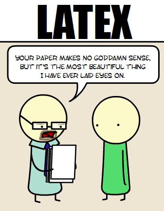

Resume Template 

Created by Jean Sung

Summer 2014

Why should I put my resume in LaTeX?? 

1) It's [beautiful](https://kieranhealy.org/blog/archives/2011/02/23/choice-of-language-and-its-consequences/).

2) It's maintainable. 
If you write your resume in Word or some other text processing version, you often end up with many versions labelled seasonYear.docx and they are slightly different. But sometimes, you need things from the past and it's a pain to gather them all from various documents. Now you can put everything you've ever done in this document, and use Github tags or releases to keep track of what's important. 

